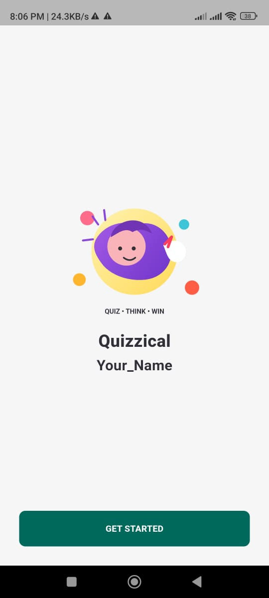
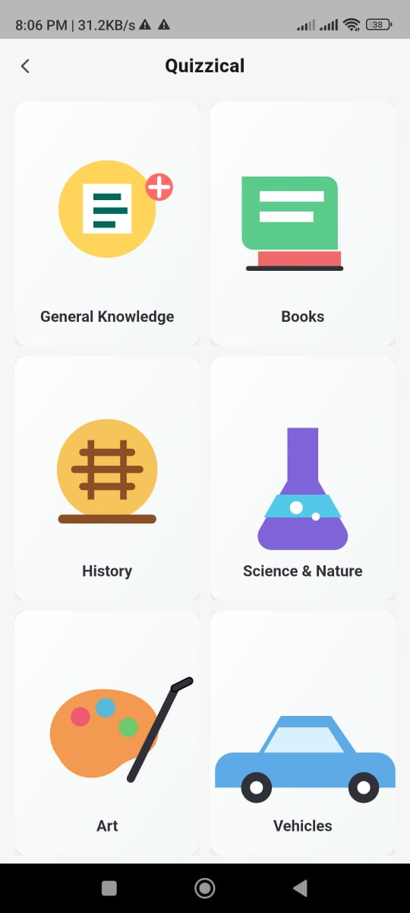
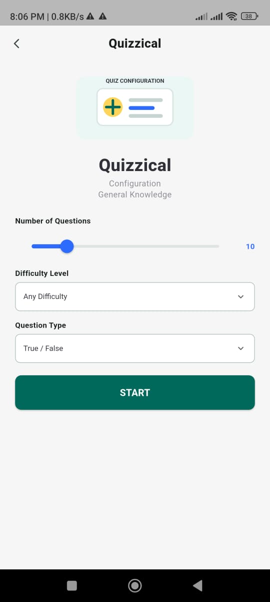
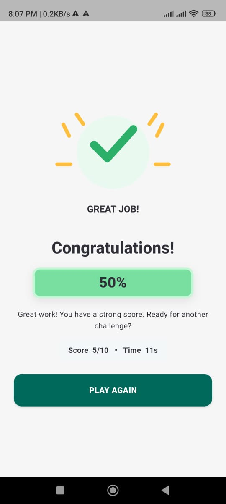

# 🧠 Quizzical — Flutter Quiz Application

A modern, responsive, and feature-rich quiz application built with Flutter and Dart, featuring category-based trivia, customizable quiz settings, timed gameplay, real-time score tracking, and an interactive results experience.

---

## 📱 Demo & Download

🎥 **[Watch Full Demo Video](YOUR_VIDEO_LINK_HERE)**

📦 **[Download Android APK — v1.0.0](https://github.com/mehedihasanrubel/Quizzical-Flutter-Quiz-App/releases)**

---

## 📱 App UI Screenshots

| Welcome Screen | Category Selection | Quiz Configuration | Quiz Results |
| :---: | :---: | :---: | :---: |
|  |  |  |  |

---

## 🌟 Key Features

* 🎯 **Category-Based Trivia** — 6 curated categories including General Knowledge, Books, History, Science & Nature, Art, and Vehicles.
* ⚙️ **Customizable Quiz Settings** — Configure question count, difficulty levels, and question types (Multiple Choice / True-False).
* ⏱️ **Timer Challenge** — Dynamic per-question countdown timer for fast-paced and engaging gameplay.
* 🔀 **Smart Randomization** — Shuffled questions and options to ensure a unique quiz experience every time.
* 📊 **Real-Time Score Tracking** — Live score and progress indicators as you answer questions.
* 🏆 **Detailed Performance Results** — Clear score percentage, performance feedback, and time tracking upon quiz completion.
* 🔄 **Instant Replay** — Seamlessly restart with the same configuration or select new settings instantly.
* 💾 **Persistent User Preferences** — Local settings storage powered by `SharedPreferences`.
* 🌐 **Dynamic REST API Data** — Powered by the Open Trivia Database (OpenTDB) API.

---

## 🛠️ Tech Stack

* **Flutter (Dart)** — Cross-platform mobile UI framework
* **Provider** — State management architecture
* **OpenTDB REST API** — Dynamic trivia question fetching
* **SharedPreferences** — Local persistent storage
* **Flutter SVG** — Scalable vector graphics and icons
* **Git & GitHub** — Version control and repository hosting

---

## 🏗️ Project Architecture

```text
lib/
├── controllers/
│   └── quiz_controller.dart
├── core/
│   ├── constants/
│   │   └── app_constants.dart
│   └── theme/
│       ├── app_colors.dart
│       └── app_theme.dart
├── models/
│   ├── quiz_category.dart
│   └── quiz_question.dart
├── services/
│   ├── trivia_service.dart
│   └── preferences_service.dart
├── screens/
│   ├── welcome_screen.dart
│   ├── category_screen.dart
│   ├── config_screen.dart
│   ├── quiz_screen.dart
│   └── results_screen.dart
├── widgets/
│   ├── phone_page.dart
│   ├── simple_top_bar.dart
│   └── error_retry.dart
└── main.dart
```

---
## 🚀 Getting Started

### Clone the repository

```bash

git clone https://github.com/mehedihasanrubel/Quizzical-Flutter-Quiz-App.git
cd Quizzical-Flutter-Quiz-App
flutter pub get
flutter run
```

> > Internet connection is required to fetch trivia questions from OpenTDB API.

---

## 👨‍💻 Author

**Mehedi Hasan Rubel**
Computer Science & Engineering
University of Barishal

🔗 **[GitHub Profile](https://github.com/mehedihasanrubel)**

---

⭐ If you find this project interesting, consider giving it a star!
